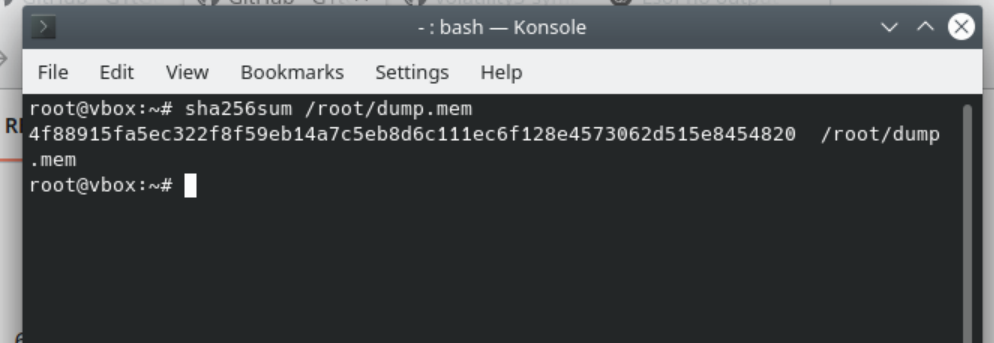
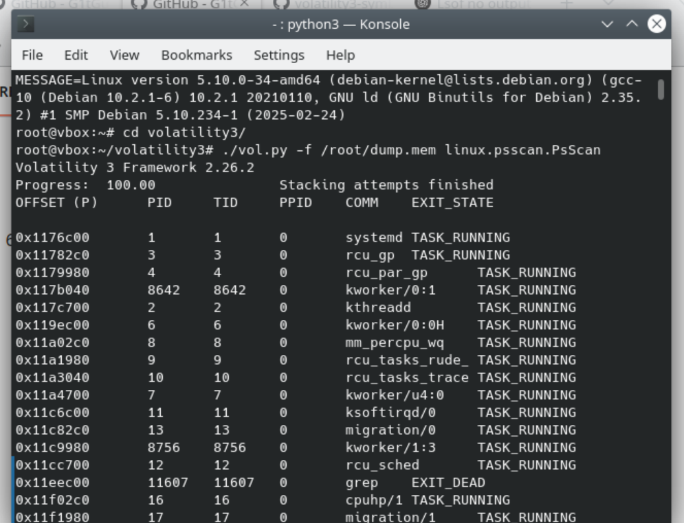
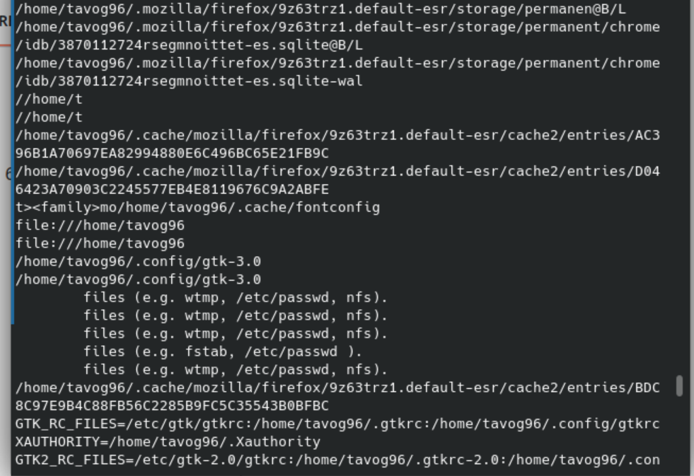
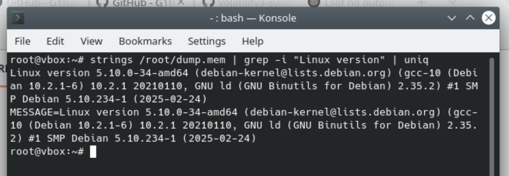

# Análisis de un Volcado de Memoria

## Descripción

Este repositorio contiene un análisis detallado de un volcado de memoria realizado en un sistema Debian 11. El objetivo es identificar artefactos y evidencias que puedan ser relevantes en una investigación de forénsica digital.

## Disclaimer

Proyecto de práctica académica para la **Universidad Internacional San Isidro Labrador**.

| Estudiante  | Gustavo Villanueva Sandi                                             |
|-------------|----------------------------------------------------------------------|
| Curso       | (CIB-12) Forénsica Digital                                           |
| Entregable  | Análisis de un volcado de memoria                                    |
| Profesor    | Saenz Córdoba Irvin Argenis                                          |
| Repositorio | [GitHub - stg-cbi12-forensic-mendump](https://github.com/G1tGut-la/stg-cbi12-forensic-mendump) |

## Archivos

- `README.md`: Documentación del proceso de análisis.

## OS de prueba

Debian 11.0 (Se tuvo que modificar la version de debian debido a que Volatility no es compatible con Debian en las versiones 11 en adelante por problemas de Kernel)

## Requerimientos

- Python 3 instalado.
- Git instalado.
- Completar el POC del repositorio [GitHub - stg-cbi10-os-raceVulnerability] (https://github.com/G1tGut-la/stg-cbi10-os-raceVulnerability)

## Instrucciones de Análisis (root)

1. **Instalar y Ejecutar LiME:** (ejecutar en /root/)
   ```bash
   sudo apt install build-essential
   ```
    ```bash
   sudo apt install lime-forensics-dkms
   ```
   ```bash
   git clone https://github.com/504ensicsLabs/LiME.git
   ```
   ```bash
   cd LiME/src
   ```
   ```bash
   sudo make
   ```
   ```bash
   sudo insmod ./lime-your_kernel_version.ko "path=/root/dump.mem format=raw"
   ```

2. **Instalar y Ejecutar Volatility3:** (ejecutar en /root/)
   ```bash
   sudo apt install -y python3-pip
   ```
   ```bash
   pip3 install volatility3
   ```
   ```bash
   git clone https://github.com/volatilityfoundation/volatility3.git
   ```
   ```bash
   cd volatility3
   ```
   ```bash
   ./vol.py -f /root/dump.mem banners.Banners
   ```

3. **Ajecutar Analisis forense extranyendo el Hash del archivo (segun lo solicitado en la actividad PDF) sobre la imagen en ejecucion:**
   ```bash
   sha256sum /root/dump.mem
   ```
   
   
4. **Configurar Volatility3**
      - Para configurar Volatility, tomar el output del comando banners.Banners (ejecutado anteriormente)
      - Usar el output para buscar el archivo de configuracion correcto para el OS de la imagen linux que estamos analizando
      - Buscar en internet (fuente externa) o en el repositorio https://github.com/Abyss-W4tcher/volatility3-symbols
      - Descargar el arhivo json (comprimido) y copiarlo en la ruta ./volatility3/symbols/linux/ (conforme indica la documentacion de [github.com/Abyss-W4tcher/](https://github.com/Abyss-W4tcher/volatility3-symbols))
  
   En mi caso:
   ```bash
   cp /home/user/Downloads/Debian_5.10.0-34-amd64_5.10.234-1_amd64.json.xz /root/volatility3/volatility3/symbols/linux/Debian_5.10.0-34-amd64_5.10.234-1_amd64.json.xz
   ```
   (cambiando {user} por el nombre usuario de la VM)
   
5. **Ajecutar Analisis forense de los ProcessID (segun lo solicitado en la actividad PDF) sobre la imagen en ejecucion:** (ejecutar en /root/volatility3)
   ```bash
   ./vol.py -f /root/dump.mem linux.psscan.PsScan
   ```
   

6. **Ajecutar Analisis forense de los usuarios activos (segun lo solicitado en la actividad PDF) sobre la imagen en ejecucion:** (ejecutar en /root/)
   ```bash
   strings dump.mem | grep -E '/home/|/etc/passwd'
   ```
   
   (Este comando en Linux retornara una busqueda completa de la imagen de todos los registros de memoria de accesos a archivos en disco ubicados en "/home/" o en "/etc/passwd", esto nos dara las pistas de cuales eran los usuarios activos recientes a la hora de extraer el dump de memoria)


## Continuacion
7. **Instalar y Ejecutar Volatility2 (Continuacion):**
La instalacion de Volatility2 aun esta pendiente y no pudo ser tomada en cuenta en el scope original de este ejercicio.
Proximamente se estara realizando la ejecucion de Volatility2 para la extraccion de los "puertos activos" (el plugin linux.netstat no esta diusponible en la version de volatility3, solo en la 2).

8. **Instalar Python 2.7** (ejecutar en /root/)
   ```bash
   sudo apt update
   ```

   ```bash
   sudo apt install python2.7
   ```

   ```bash
   wget https://bootstrap.pypa.io/pip/2.7/get-pip.py
   ```

   ```bash
   sudo python2.7 get-pip.py
   ```

   ```bash
   python2.7 --version
   ```

9. **Instalar volatility2** (ejecutar en /root/)
   ```bash
   git clone https://github.com/volatilityfoundation/volatility.git
   ```

   ```bash
   sudo python2.7 setup.py install
   ```

10. **Instalar dependencias de entorno** (ejecutar en /root/)
   ```bash
   sudo apt-get install python2.7-dev
   ```

   ```bash
   sudo pip2.7 install pycryptodome
   ```

   ```bash
   sudo pip2.7 install distorm3
   ```

   ```bash
   sudo apt-get install -y yara libyara-dev
   ```

   ```bash
   sudo pip2.7 install yara
   ```

   (Se da a entender que algunas dependencias estan ya configuradas en el entorno de ejecucion, con estos comandos se puede validar que dichas dependencias existan como es debido)

11. **Configurar volatility2 - Reconocimiento de perfil** (Al igual que volatility3, se necesita configurar un perfil para la version especifica de Linux Kernel)

      11.1. **Ajecutar Analisis forense de la version del OS (segun lo solicitado en la actividad PDF) sobre la imagen en ejecucion:**
   ```bash
   strings /root/dump.mem | grep -i "Linux version" | uniq
   ```
   (El comando anterior retorna la version de Kernel de la imagen tomada, se spera un resultado similar a "Linux Version 5.10.0-34-amd64")
   

12. **Configurar volatility2 - Descargar perfil**

      - Para configurar Volatility, tomar el output del comando strings (ejecutado anteriormente)
      - Usar el output para buscar el archivo de configuracion correcto para el OS de la imagen linux que estamos analizando
      - Buscar en internet (fuente externa) o en el repositorio https://github.com/Abyss-W4tcher/volatility2-profiles
      - Descargar el arhivo json (comprimido) y copiarlo en la ruta [volatility2_installation]/volatility/plugins/overlays/linux/ (conforme indica la documentacion de [github.com/Abyss-W4tcher/](https://github.com/Abyss-W4tcher/volatility2-profiles))

   En mi caso:
   ```bash
   cp /home/user/Downloads/Debian_5.10.0-34-amd64_5.10.234-1_amd64.zip /root/volatility/volatility/plugins/overlays/linux/Debian_5.10.0-34-amd64_5.10.234-1_amd64.zip
   ```
   (cambiando {user} por el nombre usuario de la VM)

13. **Configurar volatility2 - Verificar carga del perfil**
   ```bash
   python2.7 vol.py --info | grep Linux
   ```
   (Este comando va a retornar nuestro perfil a como Volatility lo identifica)

14. **Usar volatility2 - Deteccion de puertos y conexiones abiertas**


## Video de Demostración

[Enlace al video de demostración aquí](video/MSIVirtualMachine.mp4)

---

### Autoevaluacion
Si bien la actividad en sistemas Linux demuestra que el nivel de encriptación en dichos sistemas es relativamente baja en comparación con otros entornos y OS, y que la información volátil almacenada en la memoria RAM permanece, en la mayoría de los casos, en texto claro y sin mecanismos activos de cifrado o segmentación segura de datos sensibles, la realidad es que la capacidad de herramientas como Volatility para realizar un análisis efectivo de imágenes de memoria capturadas desde las últimas versiones o iteraciones del kernel de Linux es considerablemente limitada. Esta limitación radica en la alta velocidad con la que el ecosistema Linux libera nuevas versiones del kernel, en combinación con los cambios frecuentes en las estructuras internas del sistema operativo (por ejemplo, cambios en las estructuras task_struct, mm_struct, file, inode, entre otros), lo cual impacta directamente en la capacidad de los plugins de análisis de mantenerse compatibles.

En términos técnicos, Volatility necesita conocer la disposición exacta de las estructuras de datos internas del kernel para poder interpretar correctamente las regiones de memoria asociadas con procesos, sockets, archivos abiertos, memoria compartida, módulos del kernel, y otros elementos clave. Sin esta información, los plugins simplemente no logran extraer datos válidos o interpretan mal la memoria, lo que puede resultar en resultados nulos, incompletos o directamente erróneos. La mayoría de los plugins desarrollados para análisis Linux en Volatility están acoplados a versiones específicas del kernel, lo que significa que incluso una actualización menor en la versión (5.10.0 a 5.10.162, por ejemplo) puede romper la compatibilidad.

Para mitigar estas dificultades, la comunidad ha desarrollado mecanismos como los perfiles de configuración personalizados o, en el caso de Volatility 3, las denominadas tablas de símbolos (symbol tables). Estas tablas actúan como descripciones estructurales del kernel objetivo, mapeando símbolos, tipos de datos y offsets internos de las estructuras necesarias para los análisis. Estas symbol tables se generan extrayendo los archivos vmlinux (imagen del kernel descomprimida con símbolos de depuración), utilizando herramientas como dwarf2json para generar archivos JSON comprimidos que describen con precisión la organización de la memoria interna del sistema analizado.

La creación de estos perfiles o tablas es una tarea técnica y laboriosa, que requiere acceso al kernel original usado por el sistema víctima. En muchas distribuciones como Debian, Ubuntu, o Fedora, esto implica instalar paquetes de símbolos como linux-image-<version>-dbg o compilar manualmente el kernel con las opciones de depuración activadas. Una vez generado el perfil, Volatility puede cargar esta tabla simbólica y asociarla con la imagen de memoria analizada, permitiéndole al analista forense realizar búsquedas estructuradas sobre las regiones de memoria y utilizar plugins avanzados como linux.pslist, linux.proc_maps, linux.netstat o linux.bash con mayor precisión.

En resumen, aunque la debilidad de cifrado en memoria en Linux representa una oportunidad para el análisis forense, esta ventaja se ve contrarrestada por la complejidad técnica que supone mantener compatibilidad con la diversidad y dinamismo del kernel Linux. La generación de perfiles personalizados se convierte así en una tarea crítica para quienes deseen realizar investigaciones forenses confiables en entornos Linux modernos, permitiendo a herramientas como Volatility seguir siendo útiles a futuro. Sin el soporte de la comunidad, estas herramientas dejarian de ser utiles para interpretar la informacion, aunque, la informacion en bruto este alli, al libre acceso de quien sepa como consultarla correctamente.


---
**⚠ ADVERTENCIA:** Este código es solo para fines educativos. No utilizado en producción ni para actividades ilicitas.
